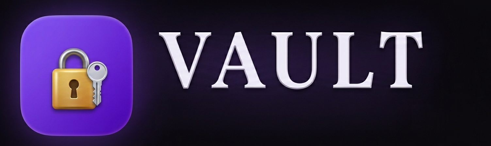

# 🏛️ VAULT — Authentication Methods Simulator


<p align="center">
  
  
  
</p>

---


<video controls src="Screenshots/VAULT.mp4" title="VAULT"></video>

## ✨ Key Features

### 📚 **Comprehensive Protocol Library** (Module 01)
- **Four core authentication protocols** with detailed architecture views
- **RADIUS**: Centralized AAA for VPN/network access (📡)
- **TACACS+**: Separated AAA with full encryption for device management (🖧)
- **Kerberos**: Ticket-based authentication with KDC/AS/TGS architecture (🎫)
- **SSO**: Single Sign-On via Kerberos + Active Directory (🔑)
- **Clickable cards** expand to reveal full protocol specifications
- **Component breakdowns** with color-coded architecture diagrams

### 🔄 **RADIUS Flow Simulator** (Module 02)
- **Step-by-step authentication sequence** through 6 phases
- **Visual packet animation** between:
  - 👤 User Client (remote access)
  - 🔀 VPN Gateway (RADIUS client)
  - 🗄️ RADIUS Server (central auth)
  - 💾 User Database (credentials store)
- **Live terminal output** showing actual RADIUS packets
- **AAA triad demonstration**: Authentication, Authorization, Accounting
- **Realistic attributes**: Access-Request, Access-Accept, Framed-IP, Session-Timeout


### 🎫 **Kerberos Ticket Exchange Lab** (Module 03)
- **Complete Kerberos workflow** with all 4 components:
  - 💻 Client workstation
  - 🔐 Authentication Server (AS)
  - 🎟️ Ticket-Granting Service (TGS)
  - 🗄️ Target file server
- **6-step ticket exchange** visualization
- **Live ticket contents** showing encrypted attributes
- **Key security insight**: Passwords never cross the network!
- **TGT and Service Ticket** lifecycle demonstration


### 🔑 **SSO with Kerberos Demo** (Module 04)
- **Real-world SSO simulation** with user "Sarah Chen"
- **Login once** to domain, access multiple resources:
  - 📧 Exchange Email Server
  - 📁 File Server Shares
  - 👥 HR Information System
  - 🌐 SharePoint Intranet
  - 🗄️ Project Database
- **Live domain controller logs** tracking authentication events
- **TGT visualization** showing active Kerberos ticket
- **Visual feedback**: Resources unlock automatically after authentication


### 🏛️ **Kerberos + Active Directory Integration** (Module 05)
- **Complete domain controller simulation** with:
  - 🔐 Kerberos KDC (AS + TGS)
  - 🗂️ Active Directory Database
  - 📋 Group Policy Engine
  - 📝 Security Audit Logs
- **5 enforced Group Policies**:
  - 🔒 Password Policy (12 chars, complexity, 90-day expiry)
  - 🚫 Account Lockout (5 attempts, 30-min lockout)
  - 🕐 Logon Hours (Mon-Fri 7AM-8PM)
  - 📊 Audit Logging (all login events tracked)
  - 🔐 MFA Enforcement (smart card/TOTP for privileged accounts)
- **Live event log** showing domain controller activities


### 📊 **Knowledge Assessment Quiz** (Module 06)
- **7 comprehensive questions** covering all protocols
- **Instant feedback** with detailed explanations
- **Progress tracking** with visual question bar
- **Final score** with personalized performance assessment
- **Retake option** for continuous learning

---

## 🚀 Quick Start

1. **Visit** 🌐 https://willie-conway.github.io/VAULT/
2. **Navigate** modules using the top navigation bar:
   - **01 Protocol Library**: Learn architecture basics
   - **02 RADIUS Flow**: Watch authentication packets
   - **03 Kerberos Lab**: Step through ticket exchange
   - **04 SSO Demo**: Experience Single Sign-On
   - **05 Kerberos + AD**: Explore Active Directory integration
   - **06 Quiz**: Test your knowledge
3. **Interact** with each module:
   - Click protocol cards to expand details
   - Press "Next Step" to advance simulations
   - Click resources after SSO login
   - Select answers in the quiz

---

## 🎯 **Learning Objectives**

| Module | Protocol | Key Concepts | Real-World Application |
|--------|----------|--------------|------------------------|
| 01 | RADIUS | Centralized AAA, UDP/1812, NAS communication | VPN authentication, Wi-Fi 802.1X, dial-up ISP |
| 01 | TACACS+ | Separated AAA, full encryption, TCP | Router/switch management, Cisco device admin |
| 01 | Kerberos | Symmetric key, KDC/AS/TGS, tickets | Windows domains, MIT realms, Google internal |
| 01 | SSO | Single login, TGT, seamless access | Enterprise environments, Office 365, corporate apps |
| 02 | RADIUS Flow | Access-Request, Access-Accept, accounting | Remote workforce authentication |
| 03 | Kerberos Lab | TGT issuance, service tickets, mutual auth | Domain-joined workstation access |
| 04 | SSO Demo | TGT persistence, resource access | Corporate intranet, file servers, email |
| 05 | AD Integration | Group Policy, account lockout, MFA | Enterprise security compliance |

---

## 🎨 **Design Philosophy**

### **Vault Aesthetic** 🏛️
- **Purple primary** (`#8b5cf6`) representing security and authority
- **Gradient backgrounds** with subtle grid patterns
- **Gem animation** in header (pulsing glow effect)
- **Cormorant Garamond** serif for elegant headings
- **Source Code Pro** monospace for terminal/technical content
- **Outfit** sans-serif for readable body text

### **Protocol Color Coding** 🎨
- 🟢 **RADIUS**: Green (`#10b981`) — network access focus
- 🔵 **TACACS+**: Blue (`#3b82f6`) — device management
- 🟡 **Kerberos**: Amber (`#f59e0b`) — ticket-based auth
- 🟣 **SSO**: Violet (`#8b5cf6`) — unified access

### **Visual Learning Aids** 📊
- **Animated packet flows** in RADIUS simulation
- **Lit nodes** showing active components
- **Ticket boxes** displaying encrypted contents
- **Step trackers** with completion status
- **Progress bars** for quiz and simulations
- **Status indicators** (● Active, ● Idle, ● Authenticated)

---

## 🛠️ **Technical Implementation**

### **Architecture**
```
┌─────────────────────────────────────┐
│          VAULT Simulator             │
│  (Single Page Application)           │
├─────────────────────────────────────┤
│                                     │
│  ┌─────────────────────────────┐   │
│  │      Module Views (6)       │   │
│  │  • Protocol Library          │   │
│  │  • RADIUS Flow               │   │
│  │  • Kerberos Lab              │   │
│  │  • SSO Demo                  │   │
│  │  • Kerberos + AD             │   │
│  │  • Quiz                      │   │
│  └─────────────────────────────┘   │
│                                     │
│  ┌─────────────────────────────┐   │
│  │     Visual Components       │   │
│  │  • Protocol cards           │   │
│  │  • Flow nodes & arrows      │   │
│  │  • Ticket displays          │   │
│  │  • Resource panels          │   │
│  │  • Terminal outputs         │   │
│  └─────────────────────────────┘   │
│                                     │
│  ┌─────────────────────────────┐   │
│  │       Data Stores           │   │
│  │  • RADIUS packet sequences  │   │
│  │  • Kerberos ticket flows    │   │
│  │  • SSO session state        │   │
│  │  • AD component status      │   │
│  │  • Quiz questions           │   │
│  └─────────────────────────────┘   │
└─────────────────────────────────────┘
```

### **Key Functions**

```javascript
// Module 1: Protocol Library
showPD(id, card)           // Expand protocol details with architecture

// Module 2: RADIUS Flow
nextRad()                   // Advance RADIUS authentication sequence
resetRad()                  // Reset RADIUS simulation

// Module 3: Kerberos Lab
nextKerb()                  // Step through Kerberos ticket exchange
resetKerb()                 // Reset Kerberos simulation

// Module 4: SSO Demo
doSSO()                     // Authenticate to domain (get TGT)
accessSSO(id, name, icon)   // Access resource via SSO
resetSSO()                  // Clear SSO session

// Module 5: Kerberos + AD
activateAD()                // Start domain controller services
resetAD()                   // Reset AD simulation

// Module 6: Quiz
renderQ()                    // Display current question
ansQ(index)                  // Process answer with feedback
showQSc()                    // Show final score screen
```

---

## 📊 **Protocol Comparison Table**

| Feature | RADIUS | TACACS+ | Kerberos | SSO |
|---------|--------|---------|----------|-----|
| **Primary Use** | Network Access | Device Admin | Domain Auth | Enterprise Access |
| **Transport** | UDP (1812/1813) | TCP (49) | UDP (88) | N/A |
| **AAA Separation** | Combined | Separated | N/A | N/A |
| **Encryption** | Password only | Full body | Symmetric keys | Ticket-based |
| **Key Component** | NAS/RADIUS Server | AAA Triad | KDC/AS/TGS | TGT + Service Tickets |
| **RFC/Standard** | RFC 2865 | Cisco Standard | RFC 4120 v5 | Windows AD |

---

## 🔐 **Security Concepts Demonstrated**

| Concept | Module | Description |
|---------|--------|-------------|
| **AAA Framework** | 01, 02 | Authentication, Authorization, Accounting separation |
| **Symmetric Key Crypto** | 03 | Shared secrets for ticket encryption |
| **Ticket-Based Auth** | 03, 04 | TGT as "passport" for session |
| **Mutual Authentication** | 03 | Both client and server verify identity |
| **Replay Prevention** | 03 | Time-stamped tickets |
| **Least Privilege** | 05 | Group Policy restrictions |
| **Account Lockout** | 05 | Brute-force protection |
| **MFA Integration** | 05 | Additional security layer |
| **Centralized Management** | 05 | Single source of truth for identities |
| **Audit Logging** | 05 | Complete access trail |

---

## 🌐 **Browser Compatibility**

| Browser | Support |
|---------|---------|
| Chrome | ✅ Full support |
| Firefox | ✅ Full support |
| Safari | ✅ Full support |
| Edge | ✅ Full support |
| Opera | ✅ Full support |
| Mobile Chrome | ✅ Responsive |
| Mobile Safari | ✅ Responsive |

---

## 🚦 **Performance**

- **Load Time**: < 1 second (zero external dependencies)
- **Memory Usage**: < 40 MB
- **CPU Usage**: Minimal (event-driven architecture)
- **Network**: Zero requests after initial load

---

## 🛡️ **Security Notes**

The VAULT simulator is **completely safe**:
- ✅ No actual authentication performed
- ✅ All simulations run in browser memory
- ✅ No network connections
- ✅ No data collection or tracking
- ✅ No external dependencies
- ✅ Educational purposes only

---

## 📝 **License**

MIT License — see LICENSE file for details.

---

## 🙏 **Acknowledgments**

- **IBM** for the comprehensive IT Security curriculum
- **IETF** for RADIUS (RFC 2865) and Kerberos (RFC 4120) standards
- **Cisco** for TACACS+ protocol specifications
- **Microsoft** for Active Directory and Kerberos integration documentation

---

## 📧 **Contact**

- **GitHub Issues**: [Create an issue](https://github.com/Willie-Conway/VAULT/issues)
- **Website**: https://willie-conway.github.io/VAULT/

---

<p align="center">
  <strong>🏛️ VAULT — Master Enterprise Authentication. Understand Protocols. Secure Networks. 🏛️</strong>
</p>


---

*Last updated: February 2026*
